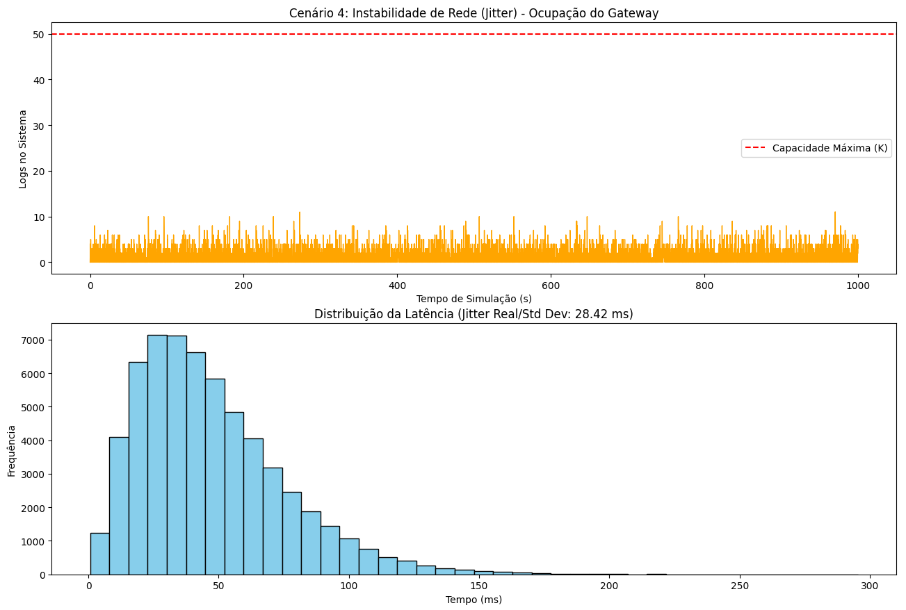

# Documentação de Simulação: Cenário 4 - Instabilidade de Rede (Jitter)

## 1. Descrição do Cenário
Este cenário simula o comportamento de um sistema IoT onde dispositivos (*smartwatches*) enviam logs para um servidor central sob condições de rede instáveis. O foco é o **Jitter**, definido como a variação estatística do atraso na entrega de pacotes (**Packet Delay Variation - PDV**).

Diferente de um atraso fixo, o Jitter faz com que logs enviados em intervalos regulares cheguem ao servidor em "rajadas" ou com espaçamentos excessivos, testando a resiliência da fila do gateway.

## 2. Parâmetros de Configuração
* **Taxa de Geração (λ):** 60 logs/segundo.
* **Capacidade do Buffer (K):** 50 logs.
* **Bit Error Rate (BER):** 1e-5 (gerando retransmissões).
* **Jitter Máximo (JITTER_MAX):** 0.05s (modelado via Distribuição Gaussiana).
* **Tempo de Simulação:** 1000 segundos.

---

## 3. Análise de Resultados

*Figura 1: Comportamento do Gateway e distribuição de atrasos sob efeito de Jitter.*

A execução do cenário apresentou os seguintes comportamentos críticos:

* **Distribuição de Latência (Assinatura do Jitter):** O histograma revelou uma **cauda longa à direita**. Enquanto a latência base situa-se em torno de 30ms, a instabilidade da rede causou dispersões frequentes, elevando o desvio padrão (Jitter Real) para a faixa de **28ms**. Isso confirma que a entrega de dados não é constante.
* **Picos de Ocupação Aleatórios:** No gráfico de ocupação, observamos picos súbitos de logs no sistema. Como a taxa de saída do rádio é limitada, esses picos são causados puramente pelo "encavalamento" de pacotes que sofreram diferentes atrasos na rede e chegaram quase simultaneamente ao servidor.
* **Eficiência do Buffer:** Apesar da instabilidade, a ocupação máxima permaneceu abaixo da capacidade crítica (50 logs). O sistema demonstrou robustez, mas o Jitter aumentou drasticamente a imprevisibilidade do tempo de resposta ponta-a-ponta.
* **Impacto das Retransmissões:** A combinação de erros de bit (BER) com Jitter criou gargalos momentâneos. Logs retransmitidos somam-se à variabilidade natural da rede, aumentando o estresse sobre a fila de entrada do backend.

---

## 4. Conclusão
O cenário de Jitter prova que, em sistemas IoT reais, não basta dimensionar o servidor pela média de tráfego. É necessário prever buffers que suportem a chegada irregular de dados para evitar descartes durante oscilações de latência da rede sem fio, garantindo a integridade dos logs coletados pelos dispositivos.